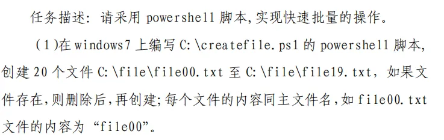

# windows服务配置-powershell创建文件夹

 

win+R运行powershell ise 

编写

$FileName = "C:\file\file"

for ($i=0; $i -le 19; $i=$i+1 ) {

​    $FileName = "C:\file\file"

​    $FileName = $FileName + "{0:00}" -f $i

​    if (Test-Path -Path $FileName){

​        Remove-Item $FileName -Recurse

​    }

​    New-Item -Path $FileName -ItemType Directory

}

